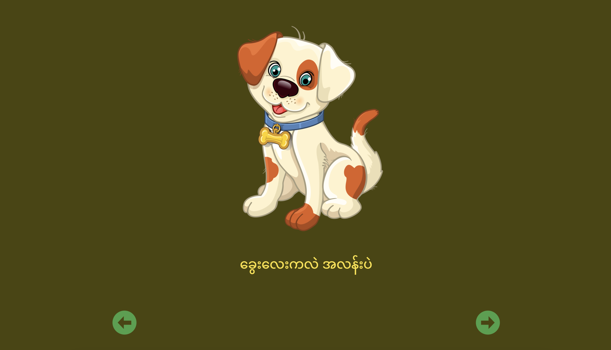

<pre style="color:darkgreen">Lessons-In-Coding</pre>

# Image Gallery with Vanilla JavaScript

- When you click left or right, then the image shows up together with the discription of the image.
- You can add more images to it

## Tools

- HTML
- CSS
- JavaScript

## Screenshot

<h2 style="color:darkgreen"> &hearts; Made with love by Lessons-In-Coding, 2024 &hearts; </h2>

